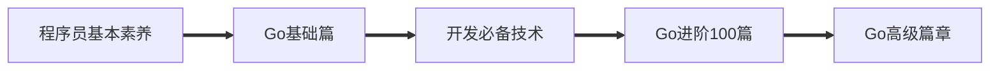

## ⚡为什么要学习 Decker？

> Docker 是世界领先的软件容器平台。
> 开发人员利用 Docker 可以消除协作编码时“在我的机器上可正常工作”的问题。
> 运维人员利用 Docker 可以在隔离容器中并行运行和管理应用，获得更好的计算密度。
> 企业利用 Docker 可以构建敏捷的软件交付管道，以更快的速度、更高的安全性和可靠的信誉为 Linux 和 Windows Server 应用发布新功能。

## 🎈怎么学习docker

> 学习docker之前最好有下面基础
>
> + [x] [计算机网络 – TCP/IP – 抓包 – Linux网络编程](https://github.com/3293172751/Block_Chain/blob/master/web/README.md) （有一点网络基础就好）
> + [x] [有Linux的基础](https://github.com/3293172751/CS_COURSE/blob/master/linux/README.md)
>
> **编程语言不限**
>
> - [x] [🖱️GO 基础部分🔥](https://github.com/3293172751/Block_Chain/blob/master/TOC.md)
> - [ ] [🖱️GO web框架](https://github.com/3293172751/Block_Chain/blob/master/go-web)
> - [ ] [🖱️Go语言100篇进阶🔥](https://github.com/3293172751/Block_Chain/blob/master/Gomd_super/README.md)
> - [ ] [🖱️Go 高级篇](https://github.com/3293172751/Block_Chain/blob/master/go-advancend/README.md)

## 📚目录

🐋 1. [Docker概述](./markdown/1.md)

🐋 2. [docker系统架构](./markdown/2.md)

🐋 3. [docker和传统虚拟机](./markdown/3.md)

🐋 4. [docker安装](./markdown/4.md)

🐋 5. [在 Ubuntu 上安装 Docker 引擎](./markdown/5.md)

🐋 6. [Docker引擎（engine）详解](./markdown/6.md)

🐋 7. [镜像配置](./markdown/7.md)

🐋 8. [docker帮助启动类命令](./markdown/8.md)

🐋 9. [docker镜像命令](./markdown/9.md)

🐋 10. [ubuntu容器说明 — 容器的启动和运行](./markdown/10.md)

🐋 11. [深入理解镜像底层](./markdown/11.md)

🐋 12. [容器rootfs命令](./markdown/12.md)

🐋 13. [使用hub.docker](./markdown/13.md)

🐋 14. [容器数据卷](./markdown/14.md)

🐋 15. [docker基础篇最后补充-资源](./markdown/15.md)

🐋 16. [tomcat安装挂载](./markdown/16.md)

🐋 17. [docker安装MySQL](./markdown/17.md)

🐋 18. [docker安装redis](./markdown/18.md)

🐋 19. [Docker高级篇](./markdown/19.md)

🐋 20. [分布式存储之hash取余算法](./markdown/20.md)

🐋 21. [3主3从redis集群扩缩容配置案例说明](./markdown/21.md)

🐋 22. [redis主从扩容](./markdown/22.md)

🐋 23. [redis主从缩容](./markdown/23.md)

🐋 24. [DockerFile解析](./markdown/24.md)

🐋 25. [dockerfile保留字](./markdown/25.md)

🐋 26. [dockerfile案例](./markdown/26.md)

🐋 27. [虚悬镜像](./markdown/27.md)

🐋 28. [编写自定义镜像myubuntu](./markdown/28.md)

🐋 29. [Docker微服务实战](./markdown/29.md)

🐋 30. [docker 网络](./markdown/30.md)

🐋 31. [docker网络模式](./markdown/31.md)

🐋 32. [bridge是什么](./markdown/32.md)

🐋 33. [host是什么](./markdown/33.md)

🐋 34. [none是什么](./markdown/34.md)

🐋 35. [container是什么](./markdown/35.md)

🐋 36. [自定义网络格式](./markdown/36.md)

🐋 37. [Docker平台架构图解](./markdown/37.md)

🐋 38. [docker-compose容器编排](./markdown/38.md)

🐋 39. [Compose核心概念](./markdown/39.md)

🐋 40. [改造升级微服务工程docker_boot](./markdown/40.md)

---

+ [x] [ 🖱️脑图下载](/markdown/脑图笔记)

---

# 菜鸟的成长手册

[Facebook](https://www.facebook.com/profile.php?id=100034435372354) | [Website](https://telsacoin.io/) | [Blog](http://cubxxw.com) | [Telegram](https://t.me/smile3293172751) | [Twitter](https://twitter.com/xxw3293172751) | [Linkedin](https://www.linkedin.cn/injobs/in/xiongxinwei-xiong-7606a0227) | [Donate](https://liberapay.com/xiongxinwei/donate)

 

+ 🔍[**快速指南(wike) — 仓库总结**](https://github.com/3293172751/Block_Chain/wiki)

+ 🔗[**中国大陆加速地址（Gitee平台）**](https://gitee.com/xxw3293172751/Block_Chain)

+ 📵[**不限速在线个人云盘**](https://xxw.cubxxw.com/s/wRSz)

  

  
  
  
  
  

  
  

---

⚠️这是一个菜鸟的成长记录，如果你也想成为工程师，想从事后端的相关工作，或者想了解区块链的相关知识，那么它可以帮助到你😎 —>  **喜欢请给个⭐收藏~**

⛓️**区块链技术（也称之为分布式账本技术）**，是一种互联网数据库技术，其特点是去中心化，公开透明，信息不可篡改性，隐私匿名性🤑

	<a href = "else/readme_english.md">🔤English</a>
	<a href = "else/readme_english.md">🆑中文</a>

## Go语言

#### 前言

`Go`语言的学习参考官网文档[go语言官方编程指南](https://golang.org/#)，如何找到合适的Go语言学习路线[Go语言路线](go-advancend/go_route.md)。

+ 🔱[go语言官方编程指南](https://golang.org/#)  

+ 🚧[Go语言路线](go-advancend/go_route.md)

#### 核心

**Go语言的核心编程篇，基础部分30天记录，100篇进阶，还有正在进展的高级篇~**

+ [x] [🖱️GO 基础部分🔥](TOC.md)

+ [ ] [🖱️GO web框架](go-web/)

+ [x] [🖱️Go语言100篇进阶🔥](Gomd_super/README.md)

+ [ ] [🖱️Go 高级篇](go-advancend/README.md)

#### 补充

`mod`包是`Go`语言2018年推出的包管理工具，并会一直延续下去。命名规范以及项目目录结构📇的设定对于一名合格的工程师来说也是非常重要的。下面是作为一名合格的开发者🤵，必须要会的基本素养。

+ [🖱️Go语言包管理工具 — mod包](Gomd_super/mod.md)
+ [🖱️命名规范](Gomd_super/name.md)
+ 🖱️[Go语言目录结构](Gomd_super/catalogue.md)
+ 🖱️[Go文件以及编码处理](Gomd_super/go_file.md)
+ 🖱️[正则表达式](Gomd_super/zhenze.md)

> Go语言一些其他的网站和博客，值得一看
>
> + [Go语言面试题](https://www.topgoer.cn/docs/gomianshiti/mianshiti)
> + [Go语言中文官方文档](http://word.topgoer.com/)
> + [Go语言专家编程地址](http://wen.topgoer.com/docs/gozhuanjia/gogfjhk)

## CS系列

CS 系列选自[🎉awesome-cs-course](https://github.com/3293172751/awesome-cs-course)，内容涵盖 计算机操作系统、csapp系列、算法和数据结构、计算机网络、`linux`、`java`、`python`、`C/C++`、`vuepress`、`gitbook`、`nodejs`、`vuejs`、`halo`、`redis``hugo`、`nginx`、`nosql`、`mysql`、`JavaScript`、`git`、`markdown`、`web`前端等笔记，更多移步到[AWESOME系列CS仓库地址](https://github.com/3293172751/CS_COURSE)

+ [x] [汇编学习🔥](汇编/README.md)

+ [ ] [软件工程](./软件工程&系统设计和架构/README.md)

+ [x] [算法与数据结构（LeetCode刷题记录）🔥](https://github.com/3293172751/LeetCode/)

+ [x] [计算机网络🔥](./web/README.md)

+ [x] [操作系统 — OS🔥](https://github.com/3293172751/os)

+ [x] [CS必须要会的技术🔥](cs/README.md)

+ [x] [最全的程序员秘密知识仓库🔥](else/uuu.md)

## 开发必备技术

🧋参与普通程序的开发或者是区块链⛓️开发必须[熟悉Linux指令](https://github.com/3293172751/CS_COURSE/blob/master/linux/README.md)，熟悉[git团队开发](https://github.com/3293172751/CS_COURSE/blob/master/Git/README.md)，基于[docker容器](docker/README.md)会让我门快速的搭建工具和环境，更好的迁移开发环境和迁移链码（blockcode)，[密码学和信息安全](cryptology/README.md)不仅仅是区块链工程师必须要学习的技术，更是IT从业者未来不可或缺的技术。我们都渴望系统能更加的安全不是吗📵。

+ [x] 🖱️ [linux从入门到精通🔥](https://github.com/3293172751/CS_COURSE/blob/master/linux/README.md)

+ [x] 🖱️ [Git—必备神器🔥](https://github.com/3293172751/CS_COURSE/blob/master/Git/README.md)

+ [x] [🖱️ Docker入门到进阶🔥](docker/README.md)

+ [x] [🖱️ 密码学和信息安全🔥](cryptology/README.md)

## 区块链学习

我认为世界历史可以用两句话来描述：分久必合，合久必分。区块链将是催化下一个‘合久必分’时代的新技术。区块链的产生铸就了一个新的时代，我们的信念是建筑在一个数学的算法上面，In math we trust。	——张首晟

从事区块链，需要哪些基础知识，看下[区块链开发需要什么](C_Universal_Brockchain\chain.md) ，你需要一份[区块链工程师路线](./blockchain/route.md)，或许你可以在一些区块链项目中找到灵感[🔗区块链公益项目（NFT+私链/联盟链/私链）](blockchain/区块链公益项目/README.md)。区块链的[共识算法](blockchain/README.md)是怎么实现的呢?

+ [x] [🔗🖱️区块链工程师路线](./blockchain/route.md)

+ [x] [🔗区块链开发需要什么❓](C_Universal_Brockchain\chain.md)

+ [x] [🔗区块链公益项目（NFT+私链/联盟链/私链）](blockchain/区块链公益项目/README.md)
+ [x] [🔗共识算法——Go语言实现](./blockchain/README.md)

### ETH–BTC

> 以太坊和比特币一样，底层框架都是区块链协议，区块链本质上是一个应用了密码学技术的分布式数据库系统。建议看一下**以太坊白皮书（需要有golang编程基础）**
>
> 

> <a href="eth/TOC.md">
> 	
> </a>

+ <del>[🖱️点击进入ETH学习](eth/TOC.md)</del>

+ [🖱️点击进入BTC学习](btc/TOC.md)

+ [🖱️点击进入Hyperledger Fabric学习](C_Universal_Brockchain/README.md)

+ [🖱️区块链技术指南](chainbrock-learning/SUMMARY.md)

> 企业级[区块链实战教程](https://learnblockchain.cn/books/enterprise/)

### 项目

> 

>   <b>c-universal blockchain（CUB-链学）</b>    
> 

>
> 

> <a href="https://github.com/C-UB">
> 	
> </a>

>
> 基于区块链的全民学习平台C-Universal Blockchain在保障用户安全，信息的完整性同时为大众带来更多的选择，笔记分享，视频分享，版权保护，以及其他的关于学信数据、电子证书、荣誉证明、成绩证明、信息授权的相关工具。

+ [ ] <del>[ 🖱️GLinux内核(未开始)]()</del>
+ [x] [ 🖱️C-Universal Brockchain](C_Universal_Brockchain/README.md)
+ [x] [ 🖱️C-Universal Brockchain（链学）组织地址](https://github.com/C-UB)

---

## 参与贡献💕

 **[🫵参与贡献💖❤️‍🩹💓💞](https://cubxxw.com/archives/contributors)** 

**要求：**

+ [你需要学会使用markdown🖱️](https://github.com/3293172751/CS_COURSE/blob/master/markdown/README.md)
+ [符合Google代码规范](https://zh-google-styleguide.readthedocs.io/en/latest/google-cpp-styleguide/)

如果你也想对本项目做出贡献，那么你可以先把该项目进行 [fork](https://github.com/3293172751/cs-awesome-Block_Chain/fork)或者 `git clone` 到本地（推荐先用 [fock](https://github.com/3293172751/cs-awesome-Block_Chain/fork)到自己仓库，然后再clone到本地，对本地进行操作，最后从自己仓库贡献，然后自己建立一个分支 `your-branch`，然后上传资料到 对应目录 下，图片信息可以上传到` /images`，然后更新 `README`。 

##  / Recent activity 

 

## 版权声明 &copy;

本书所有内容遵循[CC-BY-SA 3.0协议（署名-相同方式共享）&copy;](http://zh.wikipedia.org/wiki/Wikipedia:CC-by-sa-3.0协议文本) 
